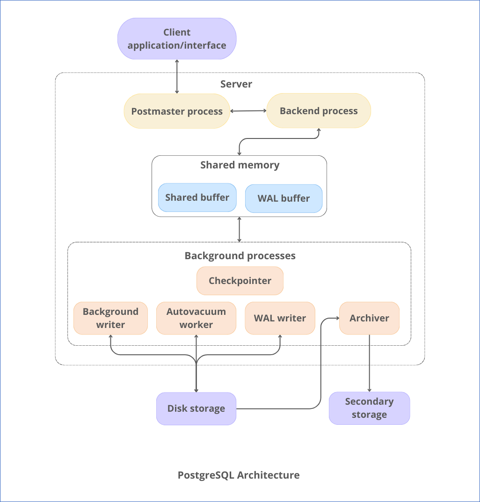
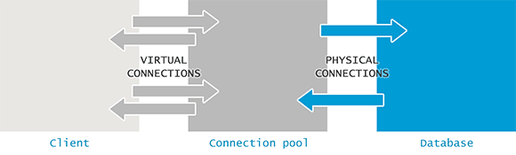

# PostgreSQL — Architecture & Administration Guide

> A comprehensive reference for understanding PostgreSQL internals, setup, and operations.

---

## Table of Contents

- [Overview](#overview)
- [Architecture](#architecture)
  - [Client Application Layer](#1-client-application-layer)
  - [Server Processes](#2-server-processes)
  - [Shared Memory](#3-shared-memory)
  - [Background Processes](#4-background-processes)
  - [Disk Storage Layer](#5-disk-storage-layer)
  - [Secondary Storage](#6-secondary-storage)
- [Query Processing Flow](#query-processing-flow)
- [WAL Archiving](#wal-archiving)
- [Installation Guide](#installation-guide)
- [Remote Connection](#remote-connection)
- [Physical (Streaming) Replication](#physical-streaming-replication)
-[Physical Backup](#physical-backup)
-[Logical Backup & Restore](#logical-backup--restore)
-[pgBouncer](#pgbouncer)
-[pgpool-II](#pgpool-ii)
 - [pgpool-II Setup & Configuration](#pgpool-ii-setup--configuration)
---

## Overview

PostgreSQL is a powerful, open-source **relational database management system (RDBMS)** built on a **multi-process architecture**. Each task is handled by a dedicated process, resulting in improved reliability, performance, and scalability.

The system is composed of five core layers:

| Layer | Role |
|---|---|
| Client Application Layer | Sends queries, receives results |
| Server Processes | Handles connections and query execution |
| Shared Memory | Caches data to reduce disk I/O |
| Background Processes | Maintains database health automatically |
| Disk Storage | Persists all permanent data |

---

# Architecture

### 1. Client Application Layer

The client is any program that communicates with the PostgreSQL server via SQL queries.

**Common client types:**
- `psql` — command-line interface
- Web frameworks — Node.js, Django, Spring, etc.
- GUI tools — pgAdmin, DBeaver

**Example query sent from a client:**
```sql
SELECT * FROM users;
```

---

### 2. Server Processes

#### 2.1 Postmaster Process

The **Postmaster** is the root process of PostgreSQL. It is responsible for:

- Starting and stopping the server
- Accepting incoming client connections
- Spawning backend processes per connection
- Managing all background processes
- Coordinating crash recovery

#### 2.2 Backend Process

A dedicated **backend process** is created for every client connection (process-per-connection model).

Responsibilities:
- Parse and plan incoming SQL queries
- Execute queries against memory or disk
- Return results to the client

> **Note:** Each client connection maps to exactly one backend process. This ensures isolation between sessions.

---

### 3. Shared Memory

Shared memory enables multiple PostgreSQL processes to efficiently share data, reducing redundant disk reads.

#### 3.1 Shared Buffer

Acts as a **page cache** for database data.

- PostgreSQL checks the shared buffer before reading from disk.
- Cache hits significantly improve query performance.
- Avoids costly repeated disk I/O for frequently accessed data.

#### 3.2 WAL Buffer

WAL stands for **Write-Ahead Logging**.

- Temporarily holds records of all database changes before they are flushed to disk.
- Guarantees **durability** — changes are logged before being applied.
- Critical for **crash recovery** — PostgreSQL can replay WAL to restore a consistent state.

```
[Data Change] → [WAL Buffer] → [WAL File on Disk] → [Data File on Disk]
```

---

### 4. Background Processes

PostgreSQL runs several background processes to maintain performance and data integrity.

| Process | Responsibility |
|---|---|
| **Checkpointer** | Periodically flushes dirty pages from shared buffers to disk |
| **Background Writer** | Gradually writes modified buffers to reduce checkpoint I/O spikes |
| **WAL Writer** | Writes WAL records from the WAL buffer to disk |
| **Autovacuum Worker** | Removes dead row versions (MVCC cleanup) and updates planner statistics |
| **Archiver** | Copies WAL segment files to external storage for backup/replication |

> **MVCC (Multi-Version Concurrency Control):** PostgreSQL keeps old row versions during updates/deletes. Autovacuum reclaims this dead space automatically.

---

### 5. Disk Storage Layer

All permanent data resides on disk. Memory is used only for caching and temporary operations.

Stored on disk:
- Tables and indexes
- System catalogs
- WAL log files
- Configuration files

---

### 6. Secondary Storage

Used for archiving WAL files and storing backups. Examples include:

- Dedicated backup servers
- Network-attached storage (NAS)
- Cloud object storage (S3, GCS, etc.)

Enables **point-in-time recovery (PITR)** and supports replication architectures.

---

## Query Processing Flow

```
Client
  │
  ▼
Postmaster        ← Accepts the connection
  │
  ▼
Backend Process   ← Parse → Plan → Execute
  │
  ├──► Shared Buffer    ← Check cache first
  │         │
  │         └──► Disk Storage  ← On cache miss
  │
  ├──► WAL Buffer       ← Log changes before writing
  │         │
  │         └──► WAL File on Disk
  │
  ▼
Result returned to Client
```

---
# WAL Archiving

### What is WAL (Write-Ahead Log)?

- Every change (INSERT, UPDATE, DELETE, DDL) is first written into WAL files.
- WAL ensures durability: if PostgreSQL crashes, it can replay these logs to recover the changes.

### What WAL Archiving Does?

When you enable WAL archiving:

```
archive_mode = on
archive_command = 'cp %p /data/pgsql/16/wal_archive/%f'
```

- PostgreSQL **copies every completed WAL file** into `/wal_archive`
- These WAL files contain **all changes made after the base backup**

### How WAL Archive Relates to Base Backup

Think of it like a timeline:

```
[Base Backup] ----[WAL1][WAL2][WAL3]----> ongoing changes
```

- Base backup = full snapshot at time T₀
- WAL archive = all changes **after T₀**
- Together, you can **replay WAL files on top of base backup** to reach any point in time (PITR)
# Installation Guide

> Tested on **Rocky Linux 9 / RHEL 9** with **PostgreSQL 16**.

### Step 1 — Check Available Disk Space

```bash
df -HT
```

Verify sufficient storage before proceeding.

---

### Step 2 — Switch to Root

```bash
sudo su -
```

---

### Step 3 — Add the Official PostgreSQL Repository

```bash
dnf install -y https://download.postgresql.org/pub/repos/yum/reporpms/EL-9-x86_64/pgdg-redhat-repo-latest.noarch.rpm
```

---

### Step 4 — Disable the Default PostgreSQL Module

```bash
dnf module disable postgresql -y
```

> This prevents conflicts between the OS default and the official PostgreSQL packages.

---

### Step 5 — Install PostgreSQL 16 Server

```bash
dnf install -y postgresql16-server
```

This installs:
- `postgresql16-server` — the database server
- `postgresql16` — client tools
- `postgresql16-libs` — required shared libraries

---

### Step 6 — Install Contrib Extensions

```bash
dnf install -y postgresql16-contrib
```

Includes useful extensions such as `pg_stat_statements`, `uuid-ossp`, and `auto_explain`.

---

### Step 7 — Create a Custom Data Directory

```bash
mkdir -p /data/pgsql/16/data/
chown postgres:postgres -R /data/pgsql/16/data/
chmod -R 700 /data/pgsql/16/data/
```

| Command | Purpose |
|---|---|
| `mkdir -p` | Creates the directory and all parent paths |
| `chown` | Assigns ownership to the `postgres` user |
| `chmod 700` | Restricts access to the `postgres` user only |

---

### Step 8 — Create the WAL Archive Directory

```bash
mkdir -p /log/archive/
chown postgres:postgres /log/archive/
chmod -R 700 /log/archive/
```

This directory will store WAL archive files used for backup and point-in-time recovery.

---

### Step 9 — Configure the systemd Service to Use the Custom Data Directory

```bash
vim /usr/lib/systemd/system/postgresql-16.service
```

Add or update the following line under the `[Service]` section:

```ini
Environment=PGDATA=/data/pgsql/16/data
```

> **Important:** No spaces around the `=` sign — systemd is strict about this syntax.

---

### Step 10 — Reload systemd

```bash
systemctl daemon-reload
```

---

### Step 11 — Initialize the Database Cluster

```bash
su - postgres
/usr/pgsql-16/bin/initdb -D /data/pgsql/16/data
exit
```

This sets up the data directory with initial system catalogs and configuration files.

---

### Step 12 — Enable and Start the Service

```bash
systemctl enable postgresql-16
systemctl start postgresql-16
```

---

### Step 13 — Verify the Service is Running

```bash
systemctl status postgresql-16
```

Look for `Active: active (running)` in the output.

---

### Step 14 — Connect to the Database

```bash
su - postgres
psql
```

To exit the `psql` shell:

```sql
\q
```

---

## Key Advantages of PostgreSQL Architecture

| Feature | Benefit |
|---|---|
| Write-Ahead Logging | Guarantees data durability and crash recovery |
| Shared Buffer Cache | Reduces disk I/O for frequently accessed data |
| Background Processes | Automates maintenance with no manual intervention |
| Process-per-Connection | Strong session isolation and stability |
| MVCC | Non-blocking reads alongside concurrent writes |

---

# Remote Connection

To allow external clients (e.g., pgAdmin on Windows) to connect to your PostgreSQL instance, two configuration files must be updated and the service restarted.

---

### Step 1 — Configure `postgresql.conf`

```bash
cd /data/pgsql/16/data
vim postgresql.conf
```

Set the following parameters:

```conf
listen_addresses = '*'
port = 5432
```

| Parameter | Purpose |
|---|---|
| `listen_addresses = '*'` | Accepts connections from all IP addresses |
| `port = 5432` | Default PostgreSQL port (ensure it is open in your firewall) |

---

### Step 2 — Configure `pg_hba.conf`

```bash
vim pg_hba.conf
```

Add the following lines to permit host-based access:

```
# TYPE  DATABASE  USER  ADDRESS       METHOD
host    all       all   0.0.0.0/0    scram-sha-256
host    all       all   ::/0         scram-sha-256
```

| Field | Explanation |
|---|---|
| `0.0.0.0/0` | Allows all IPv4 addresses |
| `::/0` | Allows all IPv6 addresses |
| `scram-sha-256` | Secure password-based authentication (recommended) |

> **Warning:** Do not use `trust` authentication in production. It bypasses password verification entirely.

---

### Step 3 — Open Firewall Port (Production)

For production environments, open only port 5432 rather than disabling the firewall:

```bash
firewall-cmd --permanent --add-port=5432/tcp
firewall-cmd --reload
```

**For testing only** — disable the firewall temporarily:

```bash
systemctl stop firewalld
systemctl disable firewalld
systemctl status firewalld
```

> **Caution:** Never disable the firewall in a production or internet-facing environment.

---

### Step 4 — Restart PostgreSQL

Apply the configuration changes:

```bash
systemctl restart postgresql-16
```

---

### Step 5 — Set a Password for the Superuser

```bash
su - postgres
psql
```

```sql
ALTER USER postgres WITH PASSWORD 'StrongPassword';
```

> **Purpose:** Secures the superuser account so remote clients can authenticate.

---

### Step 6 — Connect from pgAdmin (Windows)

1. Open **pgAdmin** → click **Add New Server**
2. **General tab:** Enter any name (e.g., `Postgres16-Rocky`)
3. **Connection tab:** Fill in the following:

| Field | Value |
|---|---|
| Host | `192.168.56.101` (your server IP) |
| Port | `5432` |
| Username | `postgres` |
| Password | The password set in Step 5 |

4. Click **Save** to connect.

---

### Troubleshooting

If the connection fails, work through the following checks:

**1. Verify network reachability**
```bash
ping 192.168.56.101
```

**2. Check PostgreSQL logs**
```bash
journalctl -xeu postgresql-16.service
```

**3. Common causes checklist**

| Issue | Fix |
|---|---|
| `listen_addresses` not set to `*` | Update `postgresql.conf` and restart |
| Client IP not in `pg_hba.conf` | Add the correct CIDR range |
| Firewall blocking port 5432 | Open TCP port 5432 or disable firewall (test only) |
| Wrong password | Re-run `ALTER USER` with the correct password |

---
# Physical (Streaming) Replication

Physical replication streams WAL data from a **primary (master)** server to one or more **standby (slave)** servers in real time, keeping them as byte-for-byte copies of the master.

---

### Prerequisites

Before starting, ensure the following on all servers:

| Requirement | Detail |
|---|---|
| PostgreSQL version | Must be **identical** on master and all slaves |
| `postgres` Linux user | Must exist on all nodes |
| Network access | Port `5432` open between master ↔ slaves |
| Time synchronization | NTP must be configured — replication is sensitive to clock drift |

---

### Part 1 — Configure the Master

#### Step 1 — Edit `postgresql.conf`

```bash
sudo su - postgres
cd /data/pgsql/16/data
vim postgresql.conf
```

Add or modify the following parameters:

```conf
listen_addresses = '*'
port = 5432
wal_level = replica
max_wal_senders = 10
wal_keep_size = 64MB
archive_mode = on
archive_command = 'rsync -a %p /log/archive/%f'
hot_standby = on
```

| Parameter | Purpose |
|---|---|
| `wal_level = replica` | Enables WAL data required for replication |
| `max_wal_senders = 10` | Max number of concurrent replication connections |
| `wal_keep_size = 64MB` | Retains WAL segments so slow slaves don't fall behind |
| `archive_mode = on` | Enables WAL archiving |
| `archive_command` | Command to copy WAL files to the archive location |
| `hot_standby = on` | Allows read queries on standby servers |

---

#### Step 2 — Edit `pg_hba.conf`

```bash
vim pg_hba.conf
```

Add replication entries for each slave:

```
# TYPE    DATABASE     USER    ADDRESS               METHOD
host      replication  slave1  192.168.47.144/32    scram-sha-256
host      replication  slave2  192.168.47.145/32    scram-sha-256
```

> Each slave must have its own dedicated replication user and IP entry.

---

#### Step 3 — Create Replication Users

```bash
psql
```

```sql
CREATE USER slave1 REPLICATION LOGIN PASSWORD 'slave1';
CREATE USER slave2 REPLICATION LOGIN PASSWORD 'slave2';
\q
```

---

#### Step 4 — Restart the Master

```bash
sudo systemctl restart postgresql-16
sudo systemctl status postgresql-16
```

---

### Part 2 — Configure Each Slave

Repeat the following steps on **each slave server**.

#### Step 1 — Stop PostgreSQL

```bash
sudo systemctl stop postgresql-16
```

#### Step 2 — Remove the Existing Data Directory

```bash
mv /data/pgsql/16/data /data/pgsql/16/data_old
```

#### Step 3 — Create a Fresh Data Directory

```bash
mkdir /data/pgsql/16/data
chown -R postgres:postgres /data/pgsql/16/data
chmod 700 /data/pgsql/16/data
```

#### Step 4 — Take a Base Backup from the Master

```bash
sudo -u postgres pg_basebackup \
  -h 192.168.14.128 \
  -D /data/pgsql/16/data \
  -U slave1 \
  -Fp -Xs -P -R
```

| Flag | Description |
|---|---|
| `-h` | Master server IP address |
| `-D` | Destination data directory on the slave |
| `-U` | Replication user to authenticate as |
| `-Fp` | Plain format — copies files directly |
| `-Xs` | Streams WAL during the backup |
| `-P` | Shows progress |
| `-R` | Writes `standby.signal` and `primary_conninfo` automatically |

> The `-R` flag is critical — it configures the slave to enter standby mode on startup automatically.

#### Step 5 — Start PostgreSQL on the Slave

```bash
sudo systemctl start postgresql-16
sudo systemctl status postgresql-16
```

#### Step 6 — Verify the Slave is in Standby Mode

```bash
sudo -u postgres psql -c "SELECT pg_is_in_recovery();"
```

Expected output:

```
 pg_is_in_recovery
-------------------
 t
(1 row)
```

`t` (true) confirms the server is operating as a standby replica.

---

### Part 3 — Verify Replication from the Master

On the **master**, run:

```bash
sudo -u postgres psql -c "SELECT client_addr, state FROM pg_stat_replication;"
```

Expected output:

```
  client_addr    |   state
-----------------+-----------
 192.168.47.144  | streaming
 192.168.47.145  | streaming
```

Both slaves should appear in `streaming` state.

---

### Part 4 — End-to-End Replication Test

**On the Master — create a table and insert data:**

```sql
CREATE TABLE test_replica (id INT);
INSERT INTO test_replica VALUES (1);
```

**On the Slave — query the table:**

```bash
sudo -u postgres psql -c "SELECT * FROM test_replica;"
```

Expected output:

```
 id
----
  1
(1 row)
```

If the row appears on the slave, replication is working correctly.

---

### Troubleshooting

| Issue | Possible Cause | Fix |
|---|---|---|
| Slave cannot connect to master | Firewall blocking port 5432 or wrong IP in `pg_hba.conf` | Open port 5432 or correct the `pg_hba.conf` entry |
| `pg_basebackup` authentication error | Wrong username or password | Verify credentials and `pg_hba.conf` replication entry |
| Slave not showing in `pg_stat_replication` | Master not restarted after config changes | Run `systemctl restart postgresql-16` on master |
| `FATAL: requested WAL segment has been removed` | Slave fell too far behind | Increase `wal_keep_size` on master |
| Version mismatch error | Master and slave PostgreSQL versions differ | Ensure identical versions on all nodes |

---
# Physical Backup

A **physical backup** copies the raw binary data files that PostgreSQL uses on disk — as opposed to a logical backup which exports SQL statements.

A physical backup includes:

| What is Copied | Description |
|---|---|
| Data files | Binary table and index files from the data directory |
| WAL files | Write-Ahead Log segments for recovery |
| Configuration files | `postgresql.conf`, `pg_hba.conf`, etc. |

Physical backups are the foundation of **point-in-time recovery (PITR)** and **standby server provisioning**.

---

### Step 1 — Create a Replication User

```bash
psql -U postgres
```

```sql
CREATE ROLE replicator WITH REPLICATION LOGIN PASSWORD 'replica123';
\du
\q
```

Verify the `replicator` role has the `Replication` attribute in the `\du` output.

---

### Step 2 — Configure the Primary Server

Edit `postgresql.conf`:

```bash
sudo nano /etc/postgresql/16/main/postgresql.conf
```

Set the following parameters:

```conf
wal_level = replica
max_wal_senders = 5
wal_keep_size = 256MB
archive_mode = on
archive_command = 'cp %p /var/lib/postgresql/wal_archive/%f'
```

| Parameter | Purpose |
|---|---|
| `wal_level = replica` | Enables WAL output needed for backup and replication |
| `max_wal_senders = 5` | Maximum concurrent WAL sender connections |
| `wal_keep_size = 256MB` | Minimum WAL retained on disk for slow receivers |
| `archive_mode = on` | Activates WAL archiving |
| `archive_command` | Shell command used to copy each WAL segment to the archive |

---

### Step 3 — Update `pg_hba.conf`

```bash
sudo nano /etc/postgresql/16/main/pg_hba.conf
```

Add the following line to allow the replication user to connect:

```
# TYPE   DATABASE     USER        ADDRESS      METHOD
host     replication  replicator  0.0.0.0/0   md5
```

---

### Step 4 — Restart PostgreSQL

```bash
sudo systemctl restart postgresql
```

---

### Step 5 — Create the WAL Archive Directory

```bash
sudo mkdir -p /var/lib/postgresql/wal_archive
sudo chown postgres:postgres /var/lib/postgresql/wal_archive
sudo chmod 700 /var/lib/postgresql/wal_archive
```

---

### Step 6 — Create the Backup Destination Directory

```bash
sudo mkdir -p /data/pgsql/16/basebackup
sudo chown postgres:postgres /data/pgsql/16/basebackup
sudo chmod 700 /data/pgsql/16/basebackup
```

---

### Step 7 — Run `pg_basebackup`

```bash
sudo -u postgres pg_basebackup \
  -U replicator \
  -D /data/pgsql/16/basebackup \
  -Fp \
  -Xs \
  -P
```

Enter the password `replica123` when prompted.

| Flag | Meaning |
|---|---|
| `-U replicator` | Authenticate as the replication user |
| `-D` | Destination directory for the backup |
| `-Fp` | Plain format — files copied as-is |
| `-Xs` | Stream WAL during the backup |
| `-P` | Show progress |

---

### Step 8 — Verify the Backup

```bash
ls -lh /data/pgsql/16/basebackup
```

A successful backup will contain:

```
base/
global/
pg_wal/
postgresql.auto.conf
pg_hba.conf
PG_VERSION
...
```

| Directory / File | Contents |
|---|---|
| `base/` | Per-database data files |
| `global/` | Cluster-wide system catalogs |
| `pg_wal/` | WAL segments captured during backup |
| `postgresql.auto.conf` | Auto-generated configuration overrides |

---
# Logical Backup & Restore

A **logical backup** exports the schema and data of your database as SQL statements or a custom binary format — unlike a physical backup which copies raw files.

| Aspect | Logical Backup | Physical Backup |
|---|---|---|
| Format | SQL or custom dump | Raw binary files |
| Granularity | Per table, schema, or database | Entire cluster |
| Best for | Migration, partial restore | Full recovery, standbys |
| Tool | `pg_dump`, `pg_dumpall` | `pg_basebackup` |

**Use logical backups for:** small/medium databases, cross-version migrations, and selective table or schema restores.

---

### 1. Single Database Backup — `pg_dump`

#### 1a. Plain SQL Format

```bash
pg_dump -U postgres -d mydb > mydb_backup.sql
```

This connects to `mydb`, exports the full schema and data, and writes it to a `.sql` file in your **current working directory**.

**Restore:**

> The target database must exist before restoring a plain SQL dump — it does not contain a `CREATE DATABASE` statement.

```bash
# Create the database first
psql -U postgres -c "CREATE DATABASE mydb;"

# Restore
psql -U postgres -d mydb < mydb_backup.sql
```

**Restore a specific table only:**

```bash
pg_restore -d mydb -t customers mydb_backup.dump
```

---

#### 1b. Custom Format (Recommended)

```bash
pg_dump -U postgres -d mydb -F c -f /var/backups/mydb_2026_02_16.dump
```

The `-F c` flag produces a **compressed custom-format dump**.

| Advantage | Detail |
|---|---|
| Compressed | Smaller file size than plain SQL |
| Faster restore | Supports parallel restore with `-j` flag |
| Selective restore | Can restore individual tables or schemas |

**Restore:**

```bash
# Create an empty target database
createdb -U postgres newdb

# Restore from the dump
pg_restore -U postgres -d newdb /var/backups/mydb_2026_02_16.dump
```

---

#### 1c. Remote Database Backup

```bash
pg_dump -h 192.168.1.20 -p 5432 -U postgres -d mydb -F c -f remote_backup.dump
```

| Flag | Purpose |
|---|---|
| `-h` | Remote host IP or hostname |
| `-p` | Port (omit if using default `5432`) |
| `-F c` | Custom compressed format |
| `-f` | Output file path |

---

### 2. All Databases Backup — `pg_dumpall`

`pg_dumpall` exports **all databases** in the cluster along with global objects such as roles and tablespaces.

```bash
pg_dumpall -U postgres > all_databases_backup.sql
```

> Unlike `pg_dump`, `pg_dumpall` only produces plain SQL format. It cannot output custom or directory format.

**Restore:**

```bash
# Using file flag
psql -U postgres -f all_databases_backup.sql postgres

# Using input redirection
psql -U postgres postgres < all_databases_backup.sql
```

---

### Quick Reference

| Task | Command |
|---|---|
| Backup single DB (SQL) | `pg_dump -U postgres -d mydb > mydb.sql` |
| Backup single DB (custom) | `pg_dump -U postgres -d mydb -F c -f mydb.dump` |
| Backup remote DB | `pg_dump -h <host> -U postgres -d mydb -F c -f remote.dump` |
| Backup all DBs | `pg_dumpall -U postgres > all.sql` |
| Restore SQL dump | `psql -U postgres -d mydb < mydb.sql` |
| Restore custom dump | `pg_restore -U postgres -d mydb mydb.dump` |
| Restore specific table | `pg_restore -U postgres -d mydb -t <table> mydb.dump` |
| Restore all DBs | `psql -U postgres -f all.sql postgres` |

---
# pgBouncer

**pgBouncer** is a lightweight **connection pooler** for PostgreSQL. It sits between your application and the database, managing connections efficiently so PostgreSQL is never overwhelmed.

**Without pgBouncer:**
```
Application → PostgreSQL (direct connection per client)
```

**With pgBouncer:**
```
Application → pgBouncer → PostgreSQL (pooled, reused connections)
```

pgBouncer maintains a small pool of persistent connections to PostgreSQL and reuses them across many client requests — dramatically reducing connection overhead.

---

### Why pgBouncer is Needed

Every PostgreSQL connection spawns a new backend process, consuming memory and CPU. Under high concurrency, this becomes a bottleneck.

| Problem (Without pgBouncer) | Solution (With pgBouncer) |
|---|---|
| Each client opens a new DB connection | Clients share a pool of existing connections |
| Thousands of connections exhaust server memory | Pool size is capped and controlled |
| Slow connection setup under heavy load | Connections are reused instantly |
| PostgreSQL process-per-connection overhead | pgBouncer absorbs the connection burst |

---

### Pooling Modes

pgBouncer supports three pooling modes with different trade-offs:

| Mode | Connection Released | Best For |
|---|---|---|
| **Session pooling** | When the client disconnects | Apps that hold long-lived sessions |
| **Transaction pooling** | After each transaction completes | Web apps, APIs (most common) |
| **Statement pooling** | After each individual statement | Simple read-heavy workloads |

> **Transaction pooling** is the most widely used mode — it gives the best balance of connection reuse and compatibility.

---

### Key Features

| Feature | Detail |
|---|---|
| Lightweight | Written in C, minimal memory footprint |
| High concurrency | Supports thousands of client connections |
| Low overhead | No query parsing or rewriting |
| Simple config | Single `.ini` configuration file |
| Protocol-level proxy | Transparent to applications |

---

### When to Use pgBouncer

pgBouncer is recommended when:

- Your application opens many short-lived connections (web frameworks, ORMs)
- You run a **microservices** architecture with many services hitting the same database
- PostgreSQL is showing high memory usage due to too many backend processes
- You need to **scale horizontally** without increasing database load

---
# pgpool-II

**pgpool-II** is a middleware layer that sits between your application and PostgreSQL servers, acting as both a **proxy** and a **connection manager**.

Instead of connecting directly to PostgreSQL, applications connect to pgpool-II, which intelligently routes queries and manages all communication with the database nodes.

```
                    Application
                         │
                         ▼
                     pgpool-II
                         │
                ┌────────┴────────┐
                ▼                 ▼
           PostgreSQL         PostgreSQL
            Primary            Replica
```

---

### Core Functionalities

#### 1. Connection Pooling

pgpool-II reuses existing database connections instead of opening a new one for every client request.

```
# Without pgpool-II
App → open connection → query → close connection

# With pgpool-II
App → pgpool-II → reuse existing connection → query
```

---

#### 2. Load Balancing

pgpool-II distributes read queries across replica nodes, reducing load on the primary.

```
SELECT → Replica
SELECT → Replica
INSERT → Primary
UPDATE → Primary
```

Read-heavy workloads benefit significantly — replicas absorb `SELECT` traffic while the primary handles all writes.

---

#### 3. Failover & High Availability

If the primary server crashes, pgpool-II can automatically promote a replica and redirect traffic.

```
Primary (down)
      │
      ▼
Replica promoted → becomes new Primary
      │
      ▼
pgpool-II redirects all traffic to new Primary
```

---

#### 4. Replication-Aware Query Routing

pgpool-II understands your replication topology and routes queries to the appropriate node — writes to the primary, reads to replicas — without any changes required in the application.

---

#### 5. Query Cache

pgpool-II can cache the results of read queries in memory. Subsequent identical queries are served directly from the cache without hitting the database.

```
# First request
SELECT * FROM users WHERE id = 1  →  hits PostgreSQL, result cached

# Subsequent requests
SELECT * FROM users WHERE id = 1  →  served from cache instantly
```

---

#### 6. Health Checking

pgpool-II continuously monitors all database nodes. If a node becomes unresponsive:

- The node is marked as `DOWN`
- pgpool-II stops routing queries to it
- Traffic is redistributed to healthy nodes automatically

---

### pgpool-II vs pgBouncer

| Feature | pgpool-II | pgBouncer |
|---|---|---|
| Connection pooling | Yes | Yes |
| Load balancing | Yes | No |
| Automatic failover | Yes | No |
| Query caching | Yes | No |
| Replication-aware routing | Yes | No |
| Complexity | Higher | Very low |
| Best for | Multi-node HA setups | High connection volume |

> **Rule of thumb:** Use **pgBouncer** when you need lightweight connection pooling. Use **pgpool-II** when you need load balancing, failover, and replication management across multiple nodes.

---
## pgpool-II Setup & Configuration

> Tested on **Rocky Linux 9 / RHEL 9** with **pgpool-II 4.5** and **PostgreSQL 16**.

---

#### Step 1 — Enable the CRB Repository

The CodeReady Builder (CRB) repository is required for some pgpool-II dependencies.

```bash
sudo dnf config-manager --set-enabled crb

# Verify CRB is enabled
sudo dnf repolist | grep crb
```

---

#### Step 2 — Install Dependencies

```bash
# Refresh package metadata
sudo dnf makecache

# Install libmemcached (required by pgpool-II)
sudo dnf install -y libmemcached-awesome
```

---

#### Step 3 — Install pgpool-II

```bash
# Add the official pgpool-II YUM repository for RHEL 9 / x86_64
sudo dnf install -y https://www.pgpool.net/yum/rpms/4.5/redhat/rhel-9-x86_64/pgpool-II-release-4.5-1.noarch.rpm

# Install pgpool-II for PostgreSQL 16
sudo dnf install -y pgpool-II-pg16

# Install pgpool-II extensions (required for SHOW pool_nodes, etc.)
sudo dnf install -y pgpool-II-pg16-extensions

# Confirm repositories are registered correctly
sudo dnf repolist
```

---

#### Step 4 — Enable and Start pgpool-II

```bash
sudo systemctl enable pgpool
sudo systemctl start pgpool
sudo systemctl status pgpool
```

---

#### Step 5 — Configure `pgpool.conf`

```bash
sudo nano /etc/pgpool-II/pgpool.conf
```

**Connection Settings**

```conf
listen_addresses = '*'
port = 9999
unix_socket_directories = '/tmp'
reserved_connections = 3
listen_backlog_multiplier = 2
serialize_accept = off
```

**PCP (pgpool Control Port) Settings**

```conf
pcp_listen_addresses = '*'
pcp_port = 9898
pcp_socket_dir = '/tmp'
```

**Clustering Mode**

```conf
backend_clustering_mode = 'streaming_replication'
```

**Backend Node 0 — Primary (Master)**

```conf
backend_hostname0 = '192.168.109.128'
backend_port0 = 5432
backend_weight0 = 0
backend_data_directory0 = '/data/pgsql/16/data'
backend_flag0 = 'ALLOW_TO_FAILOVER'
backend_application_name0 = 'master'
```

> `backend_weight0 = 0` — no read queries are routed to the primary; all reads go to replicas.

**Backend Node 1 — Replica (Standby)**

```conf
backend_hostname1 = '192.168.109.129'
backend_port1 = 5432
backend_weight1 = 1
backend_data_directory1 = '/data/pgsql/16/data'
backend_flag1 = 'ALLOW_TO_FAILOVER'
backend_application_name1 = 'replica1'
```

**Streaming Replication Check**

```conf
sr_check_user = 'pgpool'
sr_check_password = 'strong_password'
sr_check_database = 'postgres'
```

**Health Check Settings**

```conf
health_check_period = 10
health_check_timeout = 20
health_check_user = 'pgpool'
health_check_password = 'strong_password'
health_check_database = 'postgres'
```

**Password & Key File Settings**

```conf
pool_passwd = 'pool_passwd'
pgpool_key = '/var/lib/pgsql/.pgpoolkey'
```

---

#### Step 6 — Configure `pool_hba.conf`

```bash
sudo nano /etc/pgpool-II/pool_hba.conf
```

Add entries for all nodes in the cluster:

```
# TYPE  DATABASE  USER  ADDRESS                METHOD
host    all       all   192.168.109.128/32    scram-sha-256
host    all       all   192.168.109.129/32    scram-sha-256
host    all       all   192.168.109.130/32    scram-sha-256
```

Restart pgpool-II after editing:

```bash
sudo systemctl restart pgpool
```

---

#### Step 7 — Configure `pg_hba.conf` on PostgreSQL Servers

On **both master and replica**, allow the pgpool-II server to connect:

```bash
sudo nano /data/pgsql/16/data/pg_hba.conf
```

Add:

```
# Allow pgpool-II server to connect
host    all    all    192.168.109.130/32    scram-sha-256
```

Reload PostgreSQL on both servers:

```bash
sudo systemctl reload postgresql-16
```

---

#### Step 8 — Create the pgpool Role in PostgreSQL

Run on the **master** server:

```bash
sudo -u postgres psql
```

```sql
CREATE ROLE pgpool WITH LOGIN PASSWORD 'strong_password';
```

---

#### Step 9 — Set Up PCP User Authentication

PCP (pgpool Control Protocol) is used for administrative commands. Add a PCP user on the **pgpool-II server**:

```bash
# Generate MD5 hash and append user entry to pcp.conf
echo "samrat:$(pg_md5 your_password)" >> /etc/pgpool-II/pcp.conf
```

**Verify PCP connectivity** from any authorized node:

```bash
pcp_node_info -U samrat -W -h 192.168.109.130 -p 9898
```

A successful response lists node information for all registered backends.

---

#### Step 10 — Configure Password Encryption

pgpool-II stores encrypted backend passwords in `pool_passwd`.

**10.1 — Create the pgpoolkey file:**

```bash
echo "strong_password" > ~/.pgpoolkey
chmod 600 ~/.pgpoolkey
```

> `.pgpoolkey` is used to encrypt and decrypt passwords stored in `pool_passwd`. Keep it secure.

**10.2 — Encrypt and register the pgpool user password:**

```bash
pg_enc -m -k ~/.pgpoolkey -u pgpool -p
```

Enter the password for the `pgpool` database user when prompted.

**10.3 — Verify the `pool_passwd` file:**

```bash
cat /etc/pgpool-II/pool_passwd
```

Expected output:

```
pgpool:AES256hash...
```

---

#### Step 11 — Verify the Full Setup

Connect through pgpool-II and confirm all backend nodes are visible:

```bash
psql -h 192.168.109.130 -p 9999 -U pgpool -d postgres -c "SHOW pool_nodes;"
```

The output should list both backend nodes (primary and replica) with their status, roles, and load weights.

| Column | What to Check |
|---|---|
| `node_id` | 0 = primary, 1 = replica |
| `status` | Should be `up` for all nodes |
| `lb_weight` | Reflects weights set in `pgpool.conf` |
| `role` | `primary` or `standby` |


---
